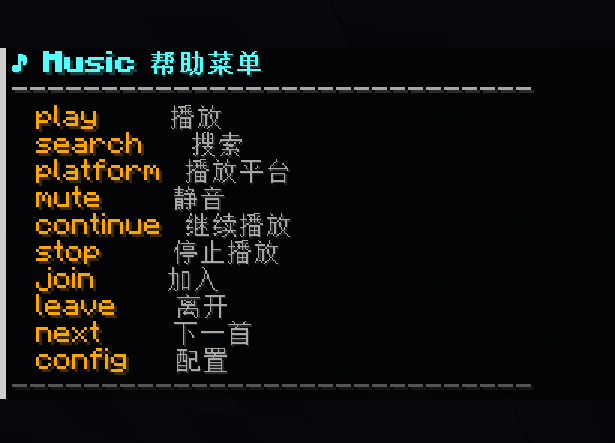
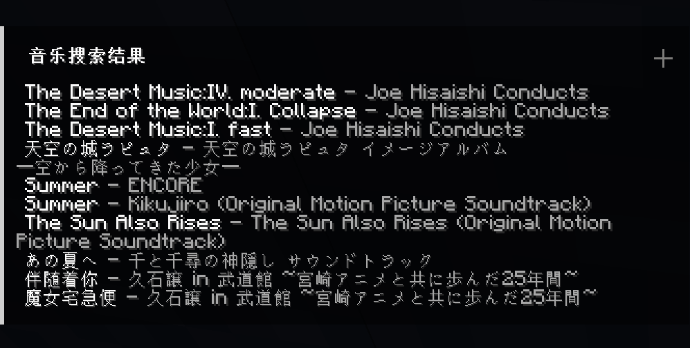
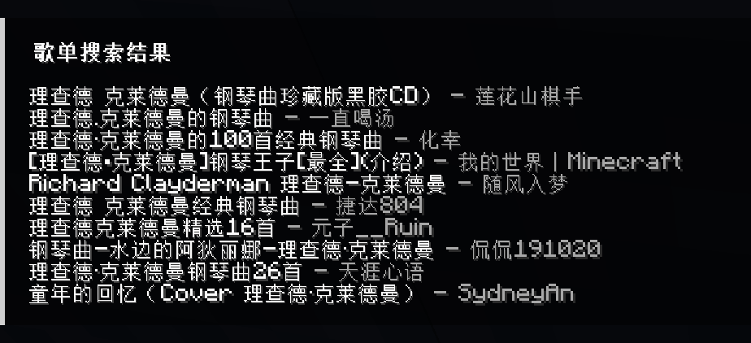
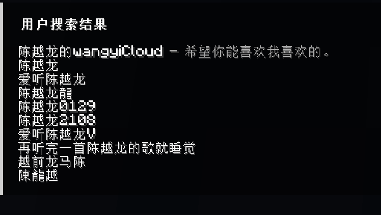
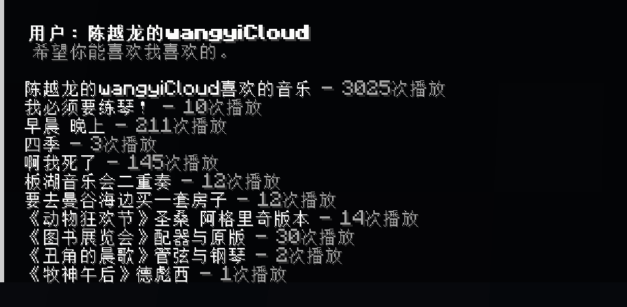
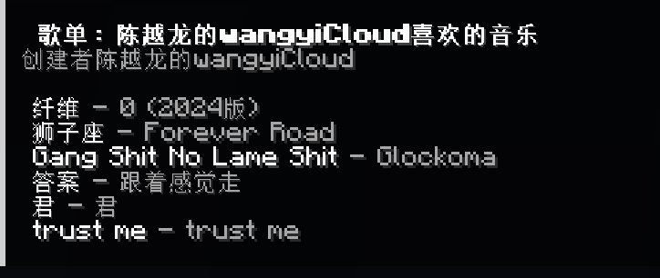
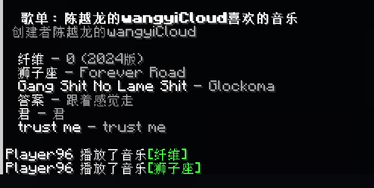

# MinecraftMusicPlayer

> 一个支持在服务器或单人游戏播放音乐的Minecraft Fabric Mod

目前只支持网易云音乐，支持播放vip音乐

## 用法

~~~ shell
# 帮助菜单
/music help
# 搜索音乐（允许点击播放）
/music search 网易云音乐 song "卡农"
# 搜索歌单（允许点击查看歌单音乐列表）
/music search 网易云音乐 playlist "轻音乐"
# 搜索用户（允许点击查看用户歌单）
/music search 网易云音乐 user "用户名"
## 代理设置(需要管理员权限)
/music config get proxy # 查看代理
/music config set proxy 127.0.0.1 7897 # 设置代理
# 退出播放
/music leave
# 加入播放
/music join
# 静音当前这首歌
/music mute once
# 播放指定音乐（音乐ID）
/music play 网易云音乐 2635279294
# 停止所有人播放（需要管理员权限）
/music stop
## 平台配置
/music platform 网易云音乐 get baseurl # 查看网易云api服务url
/music platform 网易云音乐 set "https://example.com" # 指定服务地址
~~~

## 截图

## 自部署接口服务

### 网易云接口

[使用vercel部署](https://github.com/xjuunn/NeteaseCloudMusicApi?tab=readme-ov-file#vercel-%E9%83%A8%E7%BD%B2)